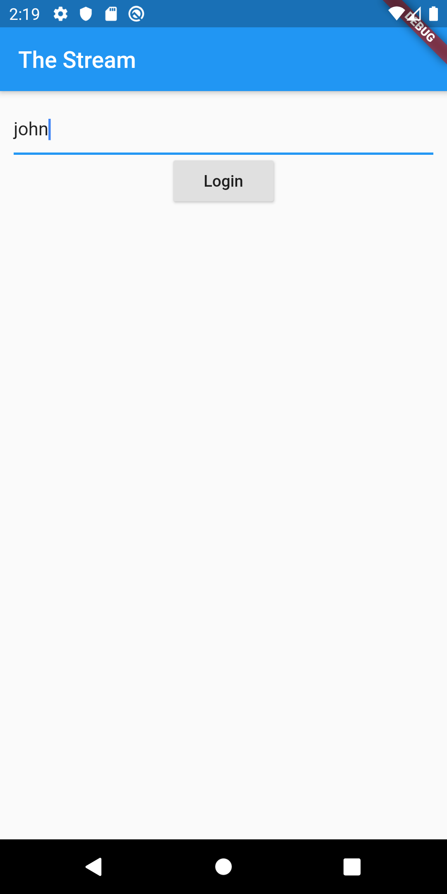
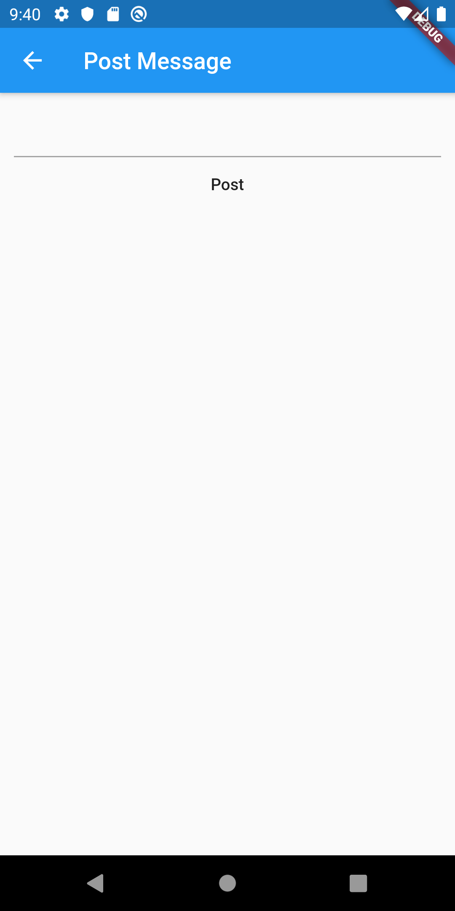
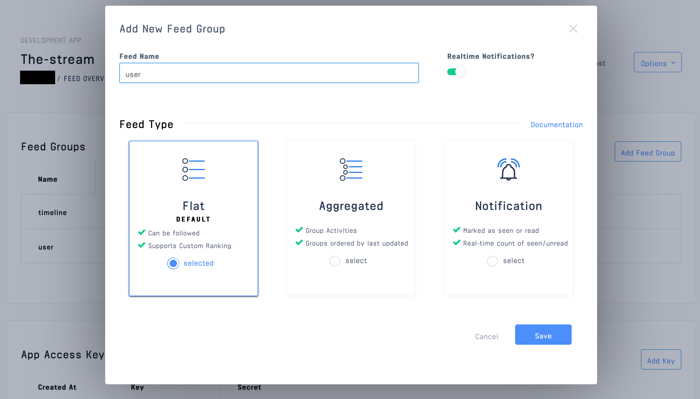
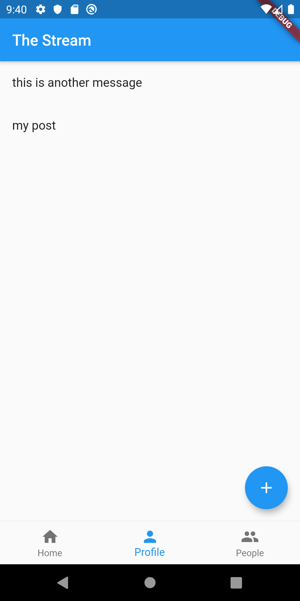
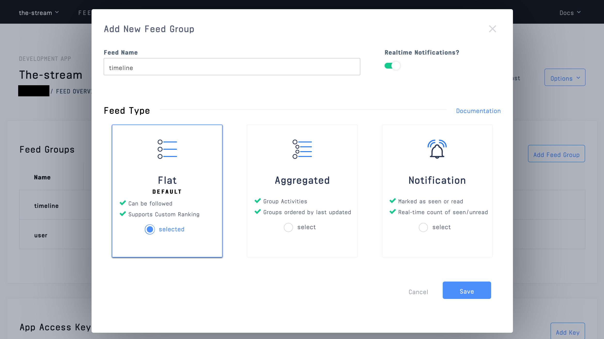
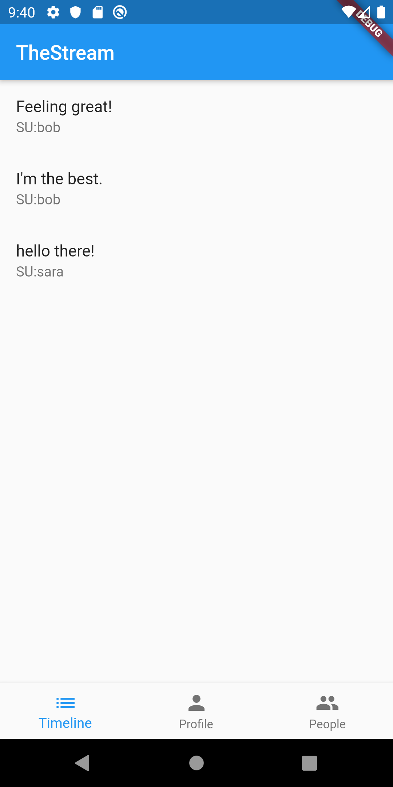

# Stream Flutter: Building a Social Network with Stream and Flutter

In this post, we'll be creating a simple social network, called Stream Flutter, that allows a user to post messages to followers. 

The app will allow a user to post a message to their followers. Stream's [Activity Feed API](https://getstream.io/activity-feeds/) combined with Google's [Flutter](https://flutter.dev/) makes it straightforward to build this sort of complex interaction. All source code for this application is available on [GitHub](https://github.com/psylinse/flutter_the_stream). This application is fully functional on both iOS and Android. 

For brevity, when we need to drop down to native code, we'll only focus on Android. You can find the corresponding iOS code to see how things are implemented. To keep things focused, we'll be showing the more important code snippets to get the idea of each piece across. Often there is context around those code snippets which are important, such as layout or navigation. Please refer to the full source if you're confused on how something works, or how we got to a screen. Each snippet will be accompanied by a comment explaining which file and line it came from.

## Building Stream Flutter: Activity Feeds

To build our social network we'll need both a backend and a mobile application. Most of the work is done in the mobile application, but we need the backend to securely create frontend tokens for interacting with the Stream API.

For the backend, we'll rely on [Express](https://expressjs.com/) (Node.js) leveraging Stream's [JavaScript library](https://github.com/GetStream/stream-js).

For the frontend, we'll build it with Flutter wrapping Stream's [Java](https://github.com/GetStream/stream-java) and [Swift](https://github.com/getstream/stream-swift) libraries. 

To post an update the app will perform these steps:

* User types their name into our mobile application to log in.
* The mobile app registers user with our backend and receives a Stream Activity Feed [frontend token](https://getstream.io/blog/integrating-with-stream-backend-frontend-options/).
* User types in their message and hits "Post". The mobile app uses the Stream token to create a Stream activity by using Flutter's [platform channels ](https://flutter.dev/docs/development/platform-integration/platform-channels) to connect to [Stream's REST API](https://getstream.io/docs_rest/) via [Java](https://github.com/GetStream/stream-java) or [Swift](https://github.com/getstream/stream-swift).
* User views their posts. The mobile app does this by retrieving its `user` feed via Stream.

If another user wants to follow a user and view their messages, the app goes through this process:
* Log in (see above).
* User navigates to the user list and selects a user to follow. The mobile app communicates with Stream API directly to create a [follower relationship](https://getstream.io/get_started/#follow) on their `timeline` feed.
* User views their timeline. The mobile app uses Stream API to retrieve their `timeline` feed, which is composed of all the messages from who they follow.

The code is split between the Flutter mobile application contained in the `mobile` directory and the Express backend is in the `backend` directory. See the `README.md` in each folder to see installing and running instructions. If you'd like to follow along with running code, make sure you get both the backend and mobile app running before continuing.

## Prerequisites

Basic knowledge of [Node.js](https://nodejs.org/en/) (JavaScript) and [Flutter](https://flutter.dev/) ([Dart](https://dart.dev/)) is required to follow this tutorial. This code is intended to run locally on your machine. 

If you'd like to follow along, you'll need an account with [Stream](https://getstream.io/accounts/signup/). Please make sure you can run a Flutter app, at least on Android. If you haven't done so, make sure you have Flutter [installed](https://flutter.dev/docs/get-started/install). If you're having issues building this project, please check if you can create run a simple application by following the instructions [here](https://flutter.dev/docs/get-started/test-drive).

Once you have an account with Stream, you need to set up a development app:


You'll need to add the credentials from the Stream app to the source code for it to work. See both the `mobile` and `backend` readmes. 

Let's get to building!

## User posts a status update
We'll start by allowing a user to post messages. 

### Step 1: Login
In order to communicate with the Stream API, we need a secure frontend token that allows our mobile application to authenticate with Stream directly. This avoids having to proxy through the `backend`. To do this, we'll need a backend endpoint that uses our Stream account secrets to generate this token. Once we have this token, we don't need the backend to do anything else, since the mobile app has access to the full Stream API. 

First, we'll be building the login screen which looks like:



To start let's layout our form in Flutter. In our `main.dart` file, we'll create a simple check to see if we're logged in, and if we don't have one, show the user a login form:

```dart
// mobile/lib/main.dart:65
@override
Widget build(BuildContext context) {
  if (_account != null) {
    // ... show full application once we're logged in
  } else {
    return Scaffold(
      appBar: AppBar(
        title: Text("The Stream"),
      ),
      body: Builder(
        builder: (BuildContext context) {
          return Container(
            padding: EdgeInsets.all(12.0),
            child: Center(
              child: Column(
                children: [
                  TextField(
                    controller: _userController,
                  ),
                  RaisedButton(
                    onPressed: () => _login(context),
                    child: Text("Login"),
                  ),
                ],
              ),
            ),
          );
        },
      ),
    );
  }
}
```

The `_account` variable is as simple `Map<String, String>` object which will contain the the backend `authToken` and a Stream `feedToken`. The `authToken` is used to make further requests the the backend, which we'll use later to retrieve a list of users. The `feedToken` is the Stream frontend token which allows access to the Stream API. 

To set the `_account` variable, we'll take the string typed in by the user once they've pressed "Login" and pass it to the `ApiService` to perform our authentication. Here's our `_login(..)` function:

```dart
// mobile/lib/main.dart:45
Future _login(BuildContext context) async {
  if (_userController.text.length > 0) {
    var creds = await ApiService().login(_userController.text);
    setState(() {
      _account = {
        'user': _userController.text,
        'authToken': creds['authToken'],
        'feedToken': creds['feedToken'],
      };
    });
  } else {
    Scaffold.of(context).showSnackBar(
      SnackBar(
        content: Text('Invalid User'),
      ),
    );
  }
}
```

We use the user's typed in name to get our credentials from the backend and store it in our `_account` variable. This is two calls, one to get our `backend` authentication token and the other to get our Stream API token. To do this, let's look at our implementation of `ApiService#login`:

```dart
// mobile/lib/api_service.dart:10
Future<Map> login(String user) async {
  var authResponse = await http.post('$_baseUrl/v1/users', body: {'sender': user});
  var authToken = json.decode(authResponse.body)['authToken'];
  var feedResponse = await http
      .post('$_baseUrl/v1/stream-feed-credentials', headers: {'Authorization': 'Bearer $authToken'});
  var feedToken = json.decode(feedResponse.body)['token'];

  return {'authToken': authToken, 'feedToken': feedToken};
}
```

Two things happen here. First, we register a user with the backend and get an `authToken`. Using this `authToken` we ask the backend to create our Stream Activity Feed frontend token. 

The user registration endpoint in the `backend` simply stores the user in memory and generates a simple token for auth. This is not a real implementation and should be replaced by however authentication and user management works for your application. Because of this, we won't go into detail here (please refer to the source code if you're interested). 

To generate our Stream token, let's look at what the backend is doing to generate that:

```javascript
// backend/src/controllers/v1/stream-feed-credentials/stream-feed-credentials.action.js:6
exports.streamFeedCredentials = async (req, res) => {
  try {
    const data = req.body;
    const apiKey = process.env.STREAM_API_KEY;
    const apiSecret = process.env.STREAM_API_SECRET;
    const appId = process.env.STREAM_APP_ID;

    const client = stream.connect(apiKey, apiSecret, appId);

    await client.user(req.user.sender).getOrCreate({ name: req.user.sender });
    const token = client.createUserToken(req.user.sender);

    res.status(200).json({ token, apiKey, appId });
  } catch (error) {
    console.log(error);
    res.status(500).json({ error: error.message });
  }
};
```

This code uses our secret account credentials to create a Stream user and register the user's name. the `getOrCreate` call creates the user with a name (or simply retrieves that user if we already registered them). Once we've created the user, we return the necessary credentials to the mobile app.

Once we're logged in, we're ready to post our first message!

### Step 2: Posting a Message

Now we'll build the form to post a status message to our Stream activity feed. We won't dive into navigation and layout in this tutorial. Please refer to the source if you're curious about how we get to this screen. We'll need to build a form that takes what the user wants to say to their followers and submit that to Stream.

First, the form:

```dart
// mobile/lib/new_activity.dart:35
@override
Widget build(BuildContext context) {
  return Scaffold(
    appBar: AppBar(
      title: Text("Post Message"),
    ),
    body: Builder(
      builder: (context) {
        return Container(
          padding: EdgeInsets.all(12.0),
          child: Center(
            child: Column(
              children: [
                TextField(
                  controller: _messageController,
                ),
                MaterialButton(
                  onPressed: () => _postMessage(context),
                  child: Text("Post"),
                ),
              ],
            ),
          ),
        );
      },
    ),
  );
}
```

Which will produce a flutter view that looks like this:



This is a straightforward Flutter widget, which uses a `TextEditingController` to track a user's input and uses a `MaterialButton` to trigger the post.

Now let's look at the implementation of `_postMessage` which is how we create the [activity](https://getstream.io/docs/#adding-activities), with our message, in Stream:

```dart
// mobile/lib/new_activity.dart:22
Future _postMessage(BuildContext context) async {
  if (_messageController.text.length > 0) {
    await ApiService().postMessage(widget.account, _messageController.text);
    Navigator.pop(context, true);
  } else {
    Scaffold.of(context).showSnackBar(
      SnackBar(
        content: Text('Please type a message'),
      ),
    );
  }
}
```

We simply take the the typed in text and pass it to our `ApiService` and pop the navigation stack to return to the previous screen. Here is the implementation of `ApiService#postMessage`:

```dart
Future<bool> postMessage(Map account, String message) async {
  return await platform.invokeMethod<bool>(
      'postMessage', {'user': account['user'], 'token': account['feedToken'], 'message': message});
}
```

Since we're going to leverage the Streams' [Java](https://github.com/getstream/stream-java) library (and [Swift](https://github.com/getstream/stream-java) on iOS), we make a call to the native implementation via Flutter's built in [Platform Channels](https://flutter.dev/docs/development/platform-integration/platform-channels). We won't go into detail on how this call happens, so either refer to the source code, or read up on Flutter's docs how to do this. Here is the Kotlin implementation (the iOS implementation is available in the source):

```kotlin
// mobile/android/app/src/main/kotlin/io/getstream/flutter_the_stream/MainActivity.kt:59
private fun postMessage(user: String, token: String, message: String) {
  val client = CloudClient.builder(API_KEY, token, user).build()

  val feed = client.flatFeed("user")
  feed.addActivity(
    Activity
      .builder()
      .actor("SU:${user}")
      .verb("post")
      .`object`(UUID.randomUUID().toString())
      .extraField("message", message)
      .build()
  ).join()
}
```

Here we use [Stream Java's](https://github.com/GetStream/stream-java) `CloudClient` from the [Cloud package](https://getstream.github.io/stream-java/io/getstream/cloud/package-summary.html). This set of classes take our frontend token which allows the mobile app to communicate directly with Stream. We are authenticated only to post activities for the actor `SU:john`. Since we aren't storing a corresponding object in a database, we generate an id to keep each post unique. We also pass along a message payload which is what our followers will see.

You may be wondering what the `client.flatFeed("user")` is referring to. In order for this to work, we need to set up a flat feed called "user" in Stream. This is where every user's feed, which only contains their messages will be stored.

Inside of your Stream development app create a flat feed called "user":



That's all we need for Stream to store our messages. Once all of these functions return we pop the Navigator to return to the user's profile screen which will display our posted messages. We'll build this next.

# Step 3: Displaying Messages on our Profile

Let's first build a Flutter widget that will contain the user's messages. Here is what the screen will look like:



And here is the code:

```dart
// mobile/lib/profile.dart:34
@override
Widget build(BuildContext context) {
  return FutureBuilder<List<dynamic>>(
    future: _activities,
    builder: (BuildContext context, AsyncSnapshot<List<dynamic>> snapshot) {
      if (!snapshot.hasData) {
        return Center(child: CircularProgressIndicator());
      }

      return Container(
        child: Center(
          child: RefreshIndicator(
            onRefresh: _refreshActivities,
            child: ListView(
              children: snapshot.data
                  .map((activity) => ListTile(
                        title: Text(activity['message']),
                      ))
                  .toList(),
            ),
          ),
        ),
      );
    },
  );
}
```

We're using a `FutureBuilder` to asynchronously load our activities. We won't go into this pattern here so please refer to the [docs](https://api.flutter.dev/flutter/widgets/FutureBuilder-class.html) or [The Boring Flutter Development Show](https://www.youtube.com/watch?v=rfagvy5xCW0&list=PLOU2XLYxmsIK0r_D-zWcmJ1plIcDNnRkK&index=4) to understand how this works. We also use a simple [`RefreshIndicator`](https://api.flutter.dev/flutter/material/RefreshIndicator-class.html) to implement pull to refresh. Putting these two built-in widgets together allows us to show a user's messages and refresh them when they post a new message.

The Stream specific code happens with our `_activities` variable. In order to get a user's activities (which contain our messages) we once again call to our `ApiService`:

```dart
// mobile/lib/profile.dart:23
Future<List<dynamic>> _getActivities() async {
  return await ApiService().getActivities(widget.account);
}
```

Our `ApiService#getActivities` calls into native code to perform the work:

```dart
// mobile/lib/api_service.dart:30
Future<dynamic> getActivities(Map account) async {
  var result =
      await platform.invokeMethod<String>('getActivities', {'user': account['user'], 'token': account['feedToken']});
  return json.decode(result);
}
```

In Kotlin, we use the `CloudClient` to ask for the user's flat feed and get the last 25 messages (activities):

```kotlin
// mobile/android/app/src/main/kotlin/io/getstream/flutter_the_stream/MainActivity.kt:74
private fun getActivities(user: String, token: String): List<Activity> {
  val client = CloudClient.builder(API_KEY, token, user).build()

  return client.flatFeed("user").getActivities(Limit(25)).join()
}
```

Next we'll see how to follow multiple user's via a timeline feed.

## User Timeline
Now that users can post messages, we'd like to follow a few and see a combined feed of all the messages for users we follow.

### Step 1: Follow a User
The first thing we need to do is view a list of users and pick a few to follow. We'll start by creating a view that shows all the users and lets a user follow a few. Here is the screen that shows all the users:


And here's the code that backs it:

```dart
// mobile/lib/people.dart:23
@override
Widget build(BuildContext context) {
  return FutureBuilder<List>(
    future: _users,
    builder: (BuildContext context, AsyncSnapshot<List> snapshot) {
      if (!snapshot.hasData) {
        return Center(child: CircularProgressIndicator());
      }

      return ListView(
        children: snapshot.data
            .where((u) => u != widget.account['user'])
            .map((u) => ListTile(
                  title: Text(u),
                  onTap: () {
                    showDialog<String>(
                      context: context,
                      builder: (BuildContext context) => AlertDialog(content: Text("Click to follow"), actions: [
                        FlatButton(
                          child: const Text('Follow'),
                          onPressed: () async {
                            await ApiService().follow(widget.account, u);
                            Navigator.pop(context, "Followed");
                          },
                        )
                      ]),
                    ).then<void>((String message) {
                      // The value passed to Navigator.pop() or null.
                      if (message != null) {
                        Scaffold.of(context)
                          ..removeCurrentSnackBar()
                          ..showSnackBar(SnackBar(
                            content: Text(message),
                          ));
                      }
                    });
                  },
                ))
            .toList(),
      );
    },
  );
}
```

This widget follows the same pattern as the profile by using a `FutureBuilder` backed by `users`. The `users` variable is backed simply a call to our `backend` service. Since the backend is not a real implementation, we'll skip the details of how the `backend` stores and retrieves users here. Please refer to the source. In Flutter we simply make a http call to retrieve the list, as seen in `ApiService#users`:

```dart
// mobile/lib/api_service.dart:20
Future<List> users(Map account) async {
  var response = await http.get('$_baseUrl/v1/users', headers: {'Authorization': 'Bearer ${account['authToken']}'});
  return json.decode(response.body)['users'];
}
```

The interesting parts are when we click a user. We show a Flutter dialog via `showDialog` which contains a single button that allows us to follow. When we press that button we trigger `ApiService#follow`. We can see how, once again, we're leveraging native libraries to do the work of following a user. Here is the Flutter side:

```dart
// mobile/lib/api_service.dart:42
Future<bool> follow(Map account, String userToFollow) async {
  return await platform.invokeMethod<bool>(
      'follow', {'user': account['user'], 'token': account['feedToken'], 'userToFollow': userToFollow});
}
```

And here is the native Kotlin side using the `CloudClient`:

```kotlin
// mobile/android/app/src/main/kotlin/io/getstream/flutter_the_stream/MainActivity.kt:86
private fun follow(user: String, token: String, userToFollow: String): Boolean {
  val client = CloudClient.builder(API_KEY, token, user).build()

  client.flatFeed("timeline").follow(client.flatFeed("user", userToFollow)).join()
  return true
}
```

Here we're adding a [follow relationship](https://getstream.io/docs/#following) to another user's `user` feed to this user's `timeline` feed. All this means is anytime a user posts to their `user` feed (implemented in the first part) we'll see it on our `timeline` feed. The cool part is, we can add any number of users feeds to our `timeline` feed and Stream will return a well-ordered list of activities.

Since we have a new feed type, we need to set this up in Stream. Just like the `user` feed, navigate to the Stream app you set up and create a flat feed group called timeline:




### Step 2: View Timeline

Now that we have a way to follow users we can view our timeline. When we're done, assuming we've followed "bob" and "sara" we'll see a screen that looks like this:



Let's look at the code to display our timeline:

```dart
// mobile/lib/timeline.dart:34
@override
Widget build(BuildContext context) {
  return FutureBuilder<List<dynamic>>(
    future: _activities,
    builder: (BuildContext context, AsyncSnapshot<List<dynamic>> snapshot) {
      if (!snapshot.hasData) {
        return Center(child: CircularProgressIndicator());
      }

      return Container(
        child: Center(
          child: RefreshIndicator(
            onRefresh: _refreshActivities,
            child: ListView(
              children: snapshot.data
                  .map((activity) => ListTile(
                        title: Text(activity['message']),
                        subtitle: Text(activity['actor']),
                      ))
                  .toList(),
            ),
          ),
        ),
      );
    },
  );
}
```

This looks identical to our `Profile` widget using both `FutureBuilder` and `RefreshIndicator` backed by a future `_activities`. Since the `timeline` is just a feed like `user`, the code is identical to how we got our user's messages. First we call `ApiService#getTimeline` which is simple a call to our native code:

```dart
// mobile/lib/api_service.dart:36
Future<dynamic> getTimeline(Map account) async {
  var result =
      await platform.invokeMethod<String>('getTimeline', {'user': account['user'], 'token': account['feedToken']});
  return json.decode(result);
}
```

And here's the corresponding native code:

```kotlin
// mobile/android/app/src/main/kotlin/io/getstream/flutter_the_stream/MainActivity.kt:80
private fun getTimeline(user: String, token: String): List<Activity> {
  val client = CloudClient.builder(API_KEY, token, user).build()

  return client.flatFeed("timeline").getActivities(Limit(25)).join()
}
```

And that's it! We now have a fully functioning mini social network. 

## Final Thoughts
Flutter and Stream make it straightforward to build a cross-platform mobile application leveraging activity feeds. Both come with a ton of functionality out of the box. If you're looking for an alternative to React Native, Flutter is a great choice. Calling native code is simple with platform channels, which allows us to use all the great libraries Stream has provided us.  
