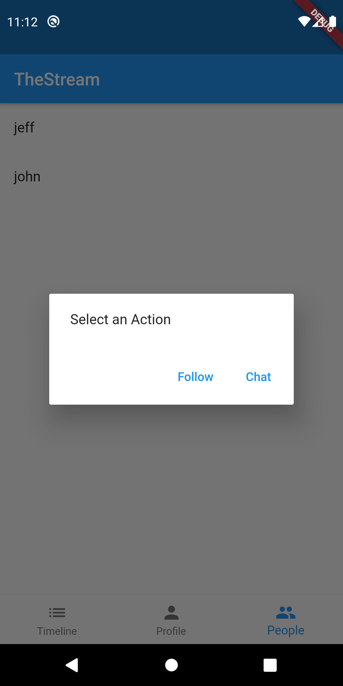
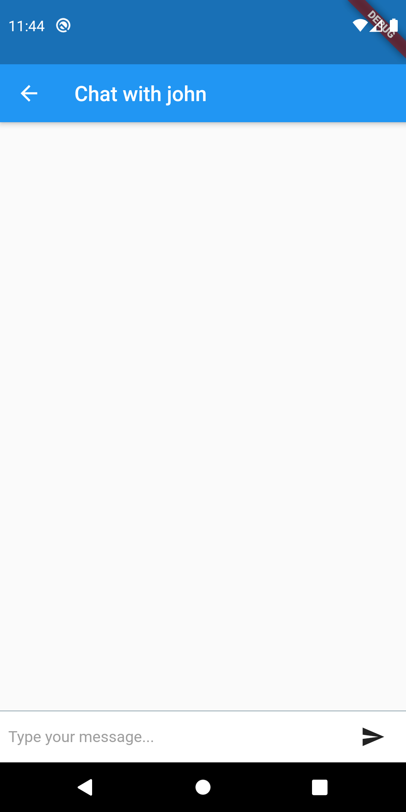

# Stream Flutter: Building a Social Network with Stream and Flutter
## Part 2: Direct Messaging

In the second part of our series we'll implement direct messaging between users by integrating [Stream Chat](https://getstream.io/chat/). This post assumes you've followed along with [part 1](https://github.com/nparsons08/stream-flutter/tree/1-social). 

## Building Stream Flutter: Direct Messaging

Leveraging our code from part 1, we'll need to modify the backend to create a Stream chat frontend token and do the rest of our work in the mobile application. The Stream chat frontend token allows us to securely authenticate our mobile application with the Stream Chat API so it can directly talk with the API without going through our backend. This token is created and stored as a part of the login process which is defined in part 1.

For the backend, we'll add in the [Stream Chat JavaScript](https://www.npmjs.com/package/stream-chat) library. 

For the mobile app, we'll build it with Flutter wrapping the Stream Chat [Android](https://github.com/GetStream/stream-chat-android) and [Swift](https://github.com/GetStream/stream-chat-swift) libraries.

The app goes through these steps to allow a user to chat with another:

* User navigates to the user list, selects a user, and clicks chat. The mobile application creates/joins a 1-on-1 chat between the two users.
* The app queries the channel for the last 50 messages and indicates to Stream that we'd like to watch this channel. The mobile app binds to a websocket to receive the stream of messages.
* The user can type a new message and sends it to the Stream API. 
* When the message is created, or a message from the other user is received, the mobile application consumes the websocket event and displays the message

Since we're relying on the Stream mobile libraries to do the heavy lifting, such as creating the websocket, this process is a dance between the Flutter code and native (Swift/Kotlin). If you'd like to follow along with running code, make sure you get both the backend and mobile app running before continuing.

## Prerequisites

Basic knowledge of [Node.js](https://nodejs.org/en/) (JavaScript), [Flutter](https://flutter.dev/) ([Dart](https://dart.dev/)), and [Kotlin](https://kotlinlang.org/), is required to follow this tutorial. This code is intended to run locally on your machine. 

If you'd like to follow along, you'll need an account with [Stream](https://getstream.io/accounts/signup/). Please make sure you can run a Flutter app, at least on Android. If you haven't done so, make sure you have Flutter [installed](https://flutter.dev/docs/get-started/install). If you're having issues building this project, please check if you can create run a simple application by following the instructions [here](https://flutter.dev/docs/get-started/test-drive).

Once you have an account with Stream, you need to set up a development app:


You'll need to add the credentials from the Stream app to the source code for it to work. See both the `mobile` and `backend` READMEs. 

Let's get to building!


## User sends a message

### Step 1: Get Stream Chat frontend token

In order to communicate with the Stream Chat API from our mobile app, we need a authenticated frontend token. To get this, we'll add a step into our login process that requests this token, essentially replicating how we received our Stream Activity Feed API frontend token. First, in Flutter, we add a step to the login that requests this token be generated by the `backend`:

```dart
// mobile/lib/api_service.dart:16
Future<Map> login(String user) async {
  var authResponse = await http.post('$_baseUrl/v1/users', body: {'sender': user});
  var authToken = json.decode(authResponse.body)['authToken'];
  var feedResponse =
      await http.post('$_baseUrl/v1/stream-feed-credentials', headers: {'Authorization': 'Bearer $authToken'});
  var feedToken = json.decode(feedResponse.body)['token'];
  var chatResponse =
      await http.post('$_baseUrl/v1/stream-chat-credentials', headers: {'Authorization': 'Bearer $authToken'});
  var chatToken = json.decode(chatResponse.body)['token'];
  await platform.invokeMethod('setupChat', {'user': user, 'token': chatToken});

  return {'authToken': authToken, 'feedToken': feedToken, 'chatToken': chatToken};
}
```

This is identical to part 1's login flow except for the `chatToken` creation and `setupChat`. Here we hit a separate `backend` endpoint `/v1/stream-chat-credentials` to generate the token. Let's look at how the backend is implemented:

Once we've received the token we can setup our chat objects by telling the native code to `setupChat`. Here is what's happening on the Android side:

```kotlin
// mobile/android/app/src/main/kotlin/io/getstream/flutter_the_stream/MainActivity.kt:95
private fun setupChat(user: String, token: String) {
  StreamChat.init(API_KEY, applicationContext)
  val client = StreamChat.getInstance(this.application)
  client.setUser(User(user), token)
}
```

Here we're initializing the `StreamChat` singleton with our `API_KEY`. We set the user on this instance so Stream knows who's talking to the API and how to authenticate them. This sets up future calls to this library to leverage this instance.

```javascript
// backend/src/controllers/v1/stream-chat-credentials/stream-chat-credentials.action.js:6
exports.streamChatCredentials = async (req, res) => {
  try {
    const data = req.body;
    const apiKey = process.env.STREAM_API_KEY;
    const apiSecret = process.env.STREAM_API_SECRET;

    const client = new StreamChat(apiKey, apiSecret);

    const user = Object.assign({}, data, {
      id: req.user.sender,
      role: 'user',
      image: `https://robohash.org/${req.user.sender}`,
    });
    const token = client.createToken(user.id);
    await client.updateUsers([user]);

    res.status(200).json({ user, token, apiKey });
  } catch (error) {
    console.log(error);
    res.status(500).json({ error: error.message });
  }
};
```

Here we use the same API credentials as the feed endpoint but use them to create a `StreamChat` instance. Using this object we can create a token and update that user in Stream. We return this data to the mobile app so it can store it for use

### Step 2: Start a chat

Once we have our token the user can navigate to the user list and indicate which user they'd like to start a chat with. To do this we'll add a new button next to "Follow" that starts the chat.



Let's look at how we add this button to this dialog:

```dart
// mobile/lib/people.dart:51
FlatButton(
  child: const Text('Chat'),
  onPressed: () {
    Navigator.pop(context); // close dialog
    Navigator.push(
      context,
      MaterialPageRoute(builder: (_) => Chat(account: widget.account, user: user)),
    );
  },
)
```

Since we already have our dialog built, this is relatively straightforward. We simply create a `FlatButton` that pushes a `Chat` widget onto the navigation stack.

### Step 3: Sending a message

First we need to create a basic layout that will display our chat messages and our input. The view looks like this:



And the Flutter code that produces this:

```dart
// mobile/lib/chat.dart:129
@override
Widget build(BuildContext context) {
  return Scaffold(
    appBar: AppBar(
      title: Text("Chat with ${widget.user}"),
    ),
    body: Builder(
      builder: (context) {
        if (_messages == null) {
          return Center(child: CircularProgressIndicator());
        }

        return Column(
          children: [
            buildMessages(_messages),
            buildInput(context),
          ],
        );
      },
    ),
  );
}
```

Here we use a simple `Scaffold` layout to give us an `AppBar` with a back button to exit the chat. If the `_messages` variable is null, which it will be on load, we'll display a loading spinner. Once the initial messages are loaded, we show the chat widgets. For now, we're going to focus on sending a message.  We'll explore how messages are loaded and displayed later.

Next, let's define `buildInput` which creates the new message input widget:

```dart
// mobile/lib/chat.dart:81
Widget buildInput(BuildContext context) {
  return Container(
    margin: EdgeInsets.only(bottom: MediaQuery.of(context).padding.bottom),
    child: Row(
      children: <Widget>[
        // Edit text
        Flexible(
          child: Container(
            padding: EdgeInsets.symmetric(horizontal: 8.0),
            child: TextField(
              style: TextStyle(fontSize: 15.0),
              controller: _messageController,
              decoration: InputDecoration.collapsed(
                hintText: 'Type your message...',
                hintStyle: TextStyle(color: Colors.grey),
              ),
            ),
          ),
        ),

        // Button send message
        Material(
          child: Container(
            margin: EdgeInsets.symmetric(horizontal: 8.0),
            child: IconButton(
              icon: Icon(Icons.send),
              onPressed: _postMessage,
            ),
          ),
          color: Colors.white,
        ),
      ],
    ),
    width: double.infinity,
    height: 50.0,
    decoration:
        BoxDecoration(border: Border(top: BorderSide(color: Colors.blueGrey, width: 0.5)), color: Colors.white),
  );
}
```

This is a `Container` that is a `Row` containing the message input and send button. The message input is `Flexible` meaning it will take up any remaining space in the `Row` not taken by the other widgets, in this case the send button. The input is bound to `_messageController` which is a `TextEditingController`. This stores whatever is typed in. 

When a user is ready to send the message, they will press the send button which triggers `_postMessage`:

```dart
// mobile/lib/chat.dart:44
Future _postMessage() async {
  if (_messageController.text.length > 0) {
    await ApiService().postChatMessage(widget.account, widget.user, _messageController.text);
    _messageController.clear();
  }
}
```

If there's a message present, we take the text and send it to the native code with the account and user that is sending the message. Once that's done, we clear the text to ready it for the next message.

Let's take a look at what's happening in `ApiService`:

```dart
// mobile/lib/api_service.dart:63
Future<bool> postChatMessage(Map account, String userToChatWith, String message) async {
  await platform.invokeMethod('postChatMessage',
      {'user': account['user'], 'userToChatWith': userToChatWith, 'message': message, 'token': account['chatToken']});
  return true;
}
```

We simply send this message, along with the `chatToken` created during login, to the native side. The native side is where we interact with Stream to send the message:

```kotlin
// mobile/android/app/src/main/kotlin/io/getstream/flutter_the_stream/MainActivity.kt:180
private fun postChatMessage(result: MethodChannel.Result, user: String, userToChatWith: String, message: String, token: String) {
  val client = StreamChat.getInstance(this.application)
  val channel = client.channel("messaging", listOf(user, userToChatWith).sorted().joinToString("-"))
  val streamMessage = Message()
  streamMessage.text = message
  channel.sendMessage(streamMessage, object : MessageCallback {
    override fun onSuccess(response: MessageResponse?) {
      result.success(true)
    }

    override fun onError(errMsg: String?, errCode: Int) {
      result.error("FAILURE", errMsg, null)
    }
  })
}
```

We start by grabbing the `StreamChat` instance that we created during login via `setupChat`. We connect to our channel, which is a `messaging` channel [type](https://getstream.io/chat/docs/initialize_channel/?language=js#channel_initialization_parameters). The channel id is the two user's ids sorted and joined together with `-`. So if we're `sara` chatting with `jeff` our channel id is `jeff-sara`. Using a unique, consistent id is important so our users are joining the correct channels!

Once we've got the correct channel initialized, we create a Stream `Message` add the text and send it to the channel. Stream is smart enough to lazily create the channel if it does not exist when we send our first message. On success we simply respond true. We could choose to send the message back to the Flutter side for display, but since we're listening to the Stream websocket for new messages, we'll see our new message come across there. We'll explore how this is done next.


